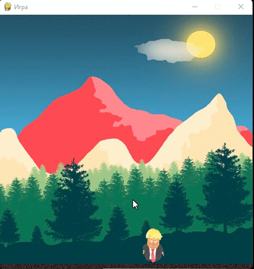

# Trump Game - маленький проект, где Трамп бегает по полю.

## Игра в прыгающего Трампа на Python!



Не помню где взял, но помню в далеком 2020 году, с какого-то youtube канала, позже добавлю источник.

## Стек технологий
- Python 3.10
- pygame 2.1.2


## Клонируем проект:
```bash
git clone git@github.com:themasterid/trump_game.git
```

или

```bash
git clone https://github.com/themasterid/trump_game.git
```

## Установка и активация виртуального окружения, а так же установка и обновление pip с установкой зависимостей:
```bash
cd trump_game
```
```bash
python -m venv venv
```
```bash
source venv/Scripts/activate
```
```bash
python -m pip install --upgrade pip
```
```bash
pip install -r requirements.txt
```

## Запуск игры

```bash
python game.py
```

## Управление

- Пробел - прыжок.
- Стрелка вправо - двигаемся вправо.
- Стрелка влево - двигаемся влево.

Играем!
